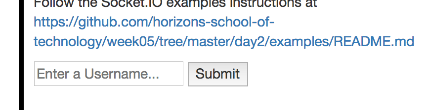

# Socket.IO Self Directed Examples

- **All videos have the password `horizonites`**
- Ask for help early and often! 🙋

---

## Part 1. Setting up `socket.io`

[Watch Me: Intro](https://vimeo.com/album/4654220/video/223158984)

[Watch Me: Setup and Overview](https://vimeo.com/album/4654220/video/223159130)

[Watch Me: Connecting to the Server](https://vimeo.com/223159315)

[Watch Me: Sending Messages](https://vimeo.com/album/4654220/video/223229132)


The following steps will walk you through creating a Node App that uses `socket.io`. You will be working in the `/week05/day2/examples/chat` directory.

1. Navigate to the appropriate directory
1. `npm install && npm start`
1. Open `localhost:3000` in your favourite browser. You should see the following page:
    
1. `npm install --save socket.io`
1. Modify `chat/app.js` to use `socket.io` (use the below code as reference)
    ```js
	var app = require('express')();
    var server = require('http').Server(app);
    var io = require('socket.io')(server);
    
    io.on('connection', function(socket){
    });
    
    var port = process.env.PORT || 3000;
    server.listen(port, function(){
      console.log('Express started. Listening on %s', port);
    });
    ```
1. Modify `chat/views/index.hbs` to use `socket.io` by adding the following `script` tags to the bottom of the file:
    ```html
	<script src="https://cdnjs.cloudflare.com/ajax/libs/socket.io/2.0.3/socket.io.js"></script>
	<script>
	  var socket = io();
	  socket.on('connect', function() {
	    console.log('Connected!');
      });
	</script>
	```
1. Now run `npm start` and go to `localhost:3000` in Chrome. If you open up console in Chrome Dev Tools it should say __Connected!__

Congratulations! You have successfully set up Socket.IO in the __chat__ app.

---

## Part 2. Sending (`.emit()`) and Receiving (`.on()`) Events

Note that you will be working with the __chat__ app from the last section, so make sure you complete the above steps before starting this instruction set. Now that you've set up `Socket.IO` with you application, it's time to create some events!

1. Attach a click handler to the __Send__ button
1. Once the button is pressed emit a _message_ event containing the text from the input box as the payload
1. On the server, listen for the _message_ event, and `console.log()` the entered input
1. Type a message into the textbox and make sure your server logs it once you press __Send__!
1. Emit the _message_ event from the server to the client
1. Create a listener for the _message_ event on the client to update our UI with the entered message (you will need to add/modify some `HTML`/`CSS` for this)
1. Type a message into the textbox and make sure the message appears on your screen! Open up `localhost:3000` in another tab and now you should be able to chat between tabs (note that at this point you __DO NOT__ need to add code to distinguish between messages by the sender vs. the receiver)

Congratulations! You've built your first real-time Chat app using Socket.IO :)

---

## Part 3. Creating users & storing per-session data

[Watch Me: Sending Messages Part II](https://vimeo.com/album/4654220/video/223162993)

[Watch Me: Storing Per-session Data](https://vimeo.com/album/4654220/video/223162788)

Note that you will be working with the __chat__ app from the last section, so make sure you complete the above steps before starting this instruction set. The following set of instructions will walk you through logging in as a certain user before using the chat app.

1. Add an input box & a submit button somewhere on the page (like below) for the user to enter a screen name
    
1. On submit your app should emit a __login__ event with the entered screen name
1. On the client make sure the screen name input box is not empty
1. If a valid username is inputted, store it on the socket object (so you should be able to access the screen name via `socket.username`)
1. Restrict chatting to __ONLY__ clients that are logged in
1. Beside each chat message write the name of the user that sent the message

---

## Part 4. Broadcasting

[Watch Me: Broadcasting Events](https://vimeo.com/album/4654220/video/223162842)

Note that you will be working with the __chat__ app from the last section, so make sure you complete the above steps before starting this instruction set.

1. When a client enters a screen name and logs in to the chatroom, their chatbox should say `"Welcome to the Chatroom [username]!"`
1. When a client enters a screen name and logs in to the chatroom, __all other clients'__ chatboxes should say `"[username] has joined the Chatroom!"`

---

## (Bonus) Part 5. Rooms

[Read me: socket.io documentation on rooms](https://socket.io/docs/rooms-and-namespaces/)

[Read me: example socket.io room code](https://gist.github.com/crtr0/2896891)

For this instruction set you will be using socket channels called rooms. You are to work in the `week05/day2/examples/rooms/` directory and implement the following functionality.

1. Add functionality for a client to join a particular room based on which button is pressed (either __Join Room 1__ or __Join Room 2__)
1. Open multiple tabs/browser windows and have multiple clients in each room
    
1. Press the __Poke!__ button, and you should see __Room #[room-number-here] has been poked__ on the clients in the corresponding room
    

### Another Rooms Example

Create an app that starts a socket connection once you navigate to `localhost:3000`. Each connected client will automatically be put into the _next available_ room, wherein each room has a 2 client limit. So, the first two clients will be in __Room 1__, the second two clients will be in __Room 2__, so on and so forth. __Note__ that you should be working in the `week05/day2/examples/rooms-limit/` directory for this example.


